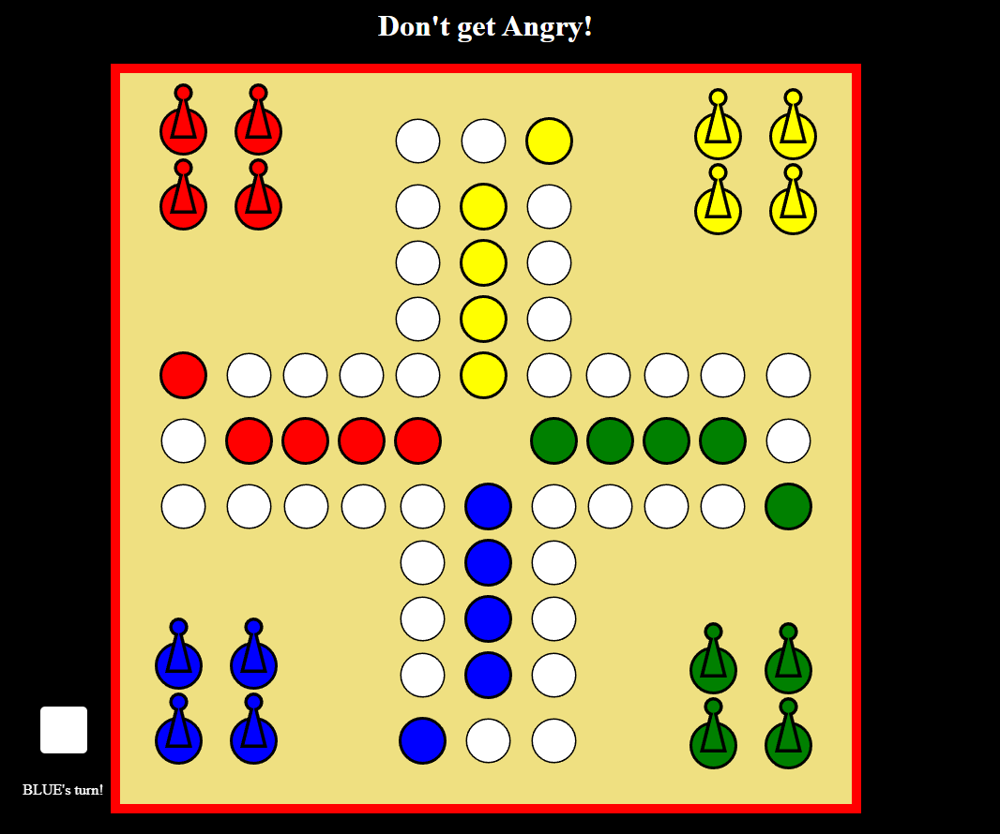

# Don't Get Angry!

## Description

"Don't Get Angry!" is a fun and challenging digital adaptation of the classic board game. The game revolves around strategic moves, luck, and a good dose of anticipation. Players navigate their pawns across the board while trying to avoid getting caught by opponents. It's a game of wit, where one wrong move can turn the tables dramatically.

## Features

1. **Classic Gameplay**: Experience the timeless gameplay of the original board game in a digital format.
6. **Intuitive Controls**: Easy-to-learn controls make it accessible for players of all ages and skill levels.

## How to Play

1. **Objective**: The goal of the game is to move all your pawns from the starting area to the home area while preventing opponents from doing the same.
2. **Gameplay**: Players take turns rolling dice and moving their pawns accordingly. Pawns can knock opponents' pawns back to the starting area if they land on the same space.
3. **Strategy**: Plan your moves carefully, considering the positions of opponents' pawns and the risks associated with each move.
4. **Winning**: The first player to successfully move all their pawns to the home area wins the game!

## License

This game is distributed under the [MIT License](https://opensource.org/licenses/MIT). See the LICENSE file for more details.

